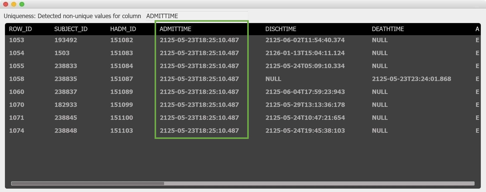

# RDB2Log
This repository contains a prototype constructed within a research project on semi-automated quality-informed event log generation for process mining.

Main interface of RDB2Log prototype

The interaction process is guided as the vital steps are ordered on the screen from top to bottom. Via a dropdown menu, the user can select the database table that will act as the case table: It contains a unique attribute that can be used as a case ID. Depending on the user's selection, possible child tables (referencing the unique key) are depicted using tabs. When selecting one of the child tables, the user receives an overview of the data columns, their data type and the values of the column quality dimensions.

Detail window for uniqueness dimension

The prototype lets the user select event log attributes for some or all of the depicted columns via dropdown selections in the main table, depending on the data they want to include in the log. After selecting an attribute, the prototype offers decision support by color-coding the dimension values: A green value means that the column's valuation regarding a quality dimension is good enough for it to be mapped to the selected event log attribute, while a red value means the opposite. The importance of the dimensions with respect to the assigned event log attributes can be edited by clicking on the "Set thresholds" button in the main frame. When clicking on a dimension value, a detail window opens and lists all data entries that have been identified as issues by the metrics in this dimension. For example, the detail window for uniqueness lists identified non-unique entries for the user to investigate further. As you can see in the second screenshot, there seems to be a problem of duplicate timestamps for a couple of admissions.

After a set of meaningful event log attributes has been selected from the data, the generation and extraction of the event log in XES format with respect to the selected attributes can be started.

Video explaining the RDB2Log approach: https://www.youtube.com/watch?v=ccwEY5QiHtw

Please address questions to r.andrews@qut.edu.au or christopher.vandun@fim-rc.de.
